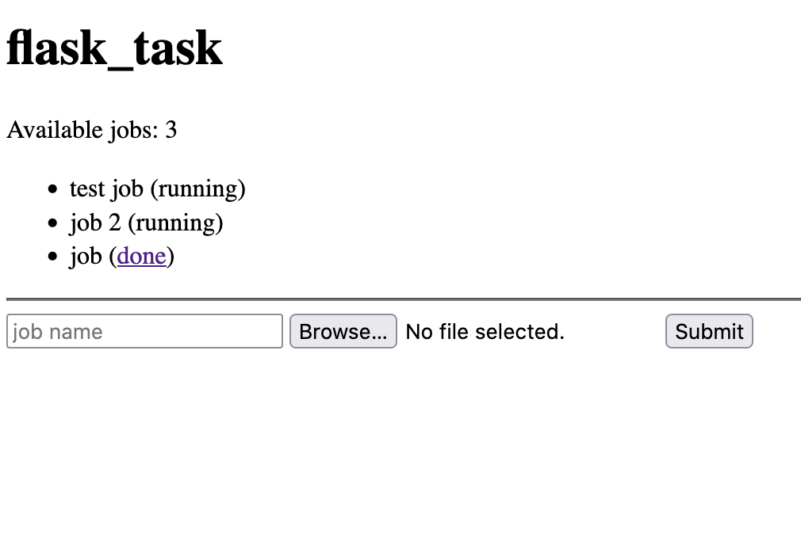

# flask_task

## what?

This is a demo of a simple Flask server for dispatching tasks on another
machine and retrieving the results when they are ready. This is built on top of
Flask and the python built-in modules for easy installation and maintenance.
Features include a simple web dashboard, auto-zipping, and no reliance on the
outside internet (making it suitable for LANs).

This is suitable for:

 - Scientific instrumentation
 - Remote job scheduling
 - Nefarious purposes



## how?

This is designed for processing of jobs with this flow:

1. Upload a file
2. Run some command which generates 1 or more results files
3. Download the folder with the results

As such, the app:

1. Listens for uploaded files
2. Creates a new folder for an uploaded file
3. Dispatches the job to whatever external processor
4. Checks for the presence of finishing files
5. Zips up the directory and makes it available for download

## i want it

### unix-based systems

Install the server with:

```
$ pip3 install Flask
```

and run it with:

```
$ python3 -m flask run --host=0.0.0.0
```

### windows

Take a deep breath and install the server with:

```
> python3 -m pip install flask
```

To start the server, cross your fingers and run:

```
> python3 -m flask run --host=0.0.0.0
```

## huh?

For programmatic access, I recommend the
[requests](https://docs.python-requests.org/en/latest/) library.

For technical support, please contact your local [patrick kage](https://ka.ge).

